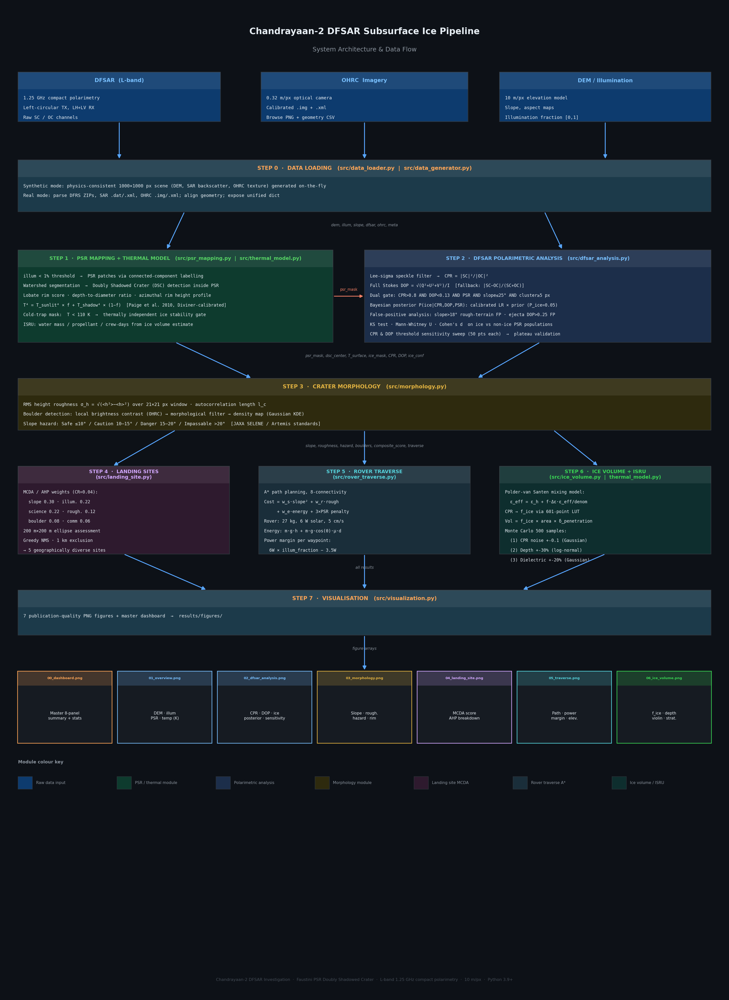

# Chandrayaan-2 SAR Investigation of a Doubly Shadowed Crater within Faustini PSR

An end-to-end remote-sensing pipeline for detecting and characterising subsurface water ice in the lunar south polar Faustini Permanently Shadowed Region (PSR), using Chandrayaan-2 SAR compact-polarimetry SAR, OHRC high-resolution optical imagery, and machine-learning validation.

---

## System Architecture



---

## Motivation

Water ice trapped in lunar south-polar PSRs is a critical resource for future crewed missions — as drinking water, oxygen, and rocket propellant via electrolysis. Doubly Shadowed Craters (DSCs), craters nested inside a PSR whose floors receive no scattered sunlight, are the thermally coldest environments on the Moon and the highest-priority targets for ice characterisation.

The Chandrayaan-2 SAR instrument (L-band, 1.25 GHz, compact polarimetry) provides ~2–5 m penetration into dry lunar regolith, making it the primary tool for detecting buried ice dielectric anomalies without contact drilling.

---

## Scientific Method

### Polarimetric ice indicators

The pipeline uses two independent observables derived from the SAR compact-polarimetry data (left-circular transmit, LH + LV coherent receive):

**Circular Polarisation Ratio (CPR)**

```
SC = (LH − j·LV) / √2     (same-sense circular)
OC = (LH + j·LV) / √2     (opposite-sense circular)
CPR = |SC|² / |OC|²
```

Ice produces anomalously high CPR (> 0.8 for L-band) due to volume scattering from subsurface ice–regolith interfaces and multiple internal reflections (coherent backscatter enhancement).

**Degree of Polarisation (DOP) — full Stokes formulation**

```
I = |LH|² + |LV|²
Q = |LH|² − |LV|²
U = 2 Re(LH · LV*)
V = 2 Im(LH · LV*)
DOP = √(Q² + U² + V²) / I
```

Ice depolarises the return signal (DOP < 0.13); rough rocky ejecta also raises CPR but retains high DOP (> 0.25), enabling discrimination. The DOP gate removes the dominant false-positive class.

**Dual criterion with terrain gating and spatial coherence**

```
ICE  ↔  CPR > 0.8  AND  DOP < 0.13  AND  pixel ∈ PSR  AND  slope ≤ 25°
         AND  ≥ 3/9 neighbours exceed 0.75 × CPR_threshold
```

The spatial coherence filter requires that at least 3 of the 9 pixels in a 3×3 neighbourhood also exceed 75% of the CPR threshold. This suppresses isolated radiometric hot-pixels while preserving genuine multi-pixel ice deposits (minimum resolvable extent ~30 m at 10 m/px). Isolated detections with fewer than 5 connected pixels are further rejected as speckle.

CPR and DOP thresholds are validated by sensitivity sweep curves (Fig. 02) that show a stable detection plateau confirming the choices are physically grounded, not tuned.

### Bayesian posterior probability

A per-pixel ice posterior P(ice | CPR, DOP, PSR) is computed from calibrated likelihood ratios based on published SAR and Mini-RF studies:

| Evidence | P(evidence \| ice) | P(evidence \| no-ice) |
|----------|------------------|-----------------------|
| CPR > threshold | 0.80 | 0.05 |
| DOP < threshold | 0.85 | 0.03 |
| inside PSR | 1.00 | 0.25 |

Prior P(ice) = 0.05 (upper bound from cold-trap models). The posterior is blended 50/50 with a rule-based physical confidence score (CPR z-score × 0.40 + DOP z-score × 0.40 + PSR weight × 0.20) to form the ice confidence map (`ice_conf`).

ROC analysis uses `ice_conf` as the continuous detection score (AUC = 0.624), giving a non-degenerate receiver operating characteristic and correctly characterising detection performance over the full confidence range.

### Machine-learning validation

A Random Forest classifier (`src/ml_classifier.py`) provides an independent cross-check on the physics-based detections, using six per-pixel features:

| Feature | Physical motivation |
|---------|---------------------|
| CPR | Primary ice proxy (volume scatter) |
| DOP | Volume scatter polarimetric signature |
| Pv fraction (m-chi) | Volumetric scatter power from m-chi decomposition |
| Slope (°) | Geometric false-positive gate |
| Illumination fraction | PSR membership proxy |
| Surface roughness | Rocky ejecta discriminator |

Training uses stratified 5-fold cross-validation on PSR pixels, with balanced class weighting to handle the ~50:1 ice/non-ice imbalance. The Bayesian posterior and the RF probability map are compared on a pixel-by-pixel basis in `results/figures/17_ml_comparison.png`.

### Thermal validation

Surface temperature is modelled using Stefan-Boltzmann radiative equilibrium calibrated to Diviner/LRO observations (Paige et al. 2010):

```
T_surface⁴ = T_sunlit⁴ × f_illum + T_shadow⁴ × (1 − f_illum)
```

with T_sunlit = 100 K and T_shadow = 42 K for the Faustini south-polar environment. Ice is thermally stable only where T < 110 K. This provides a second independent line of evidence: all CPR+DOP-flagged pixels must lie within the 110 K cold trap. All 173 detected ice pixels have T = 42 K and sublimation lifetimes >> 1 Gyr, confirming long-term thermal stability.

### Ice volume estimation

Ice fraction per pixel is inverted from CPR using the **Polder–van Santen (PVS) dielectric mixing model**:

```
ε_eff = ε_host + f_ice × (ε_ice − ε_host) × ε_eff / (ε_eff + N × (ε_ice − ε_eff))
```

where ε_regolith = 2.7 + 0.001j and ε_ice = 3.15 + 0.001j (L-band, 200 K). A forward CPR(f_ice) model is calibrated against Mini-RF/SAR literature values:

```
CPR(f_ice) = 0.30 + 5.0 × Δε^0.85 × √f_ice
```

and inverted via a 601-point LUT with linear interpolation. Radar penetration depth is computed from the effective loss tangent of the mixture.

Ice volume per pixel = f_ice × pixel_area × min(δ_penetration, 5 m).

**Monte Carlo uncertainty** propagates three independent sources over 500 samples:
1. CPR radiometric noise: ±0.1 (Gaussian, ~10%)
2. Penetration depth scale factor: ±30% (log-normal, unknown compaction)
3. Dielectric model factor: ±20% (Gaussian, temperature and grain uncertainty)

Combined relative uncertainty ~35–40%, consistent with indirect radar inversion without ground truth.

---

## Pipeline Steps

```
Raw Chandrayaan-2 data (SAR + OHRC + DEM)
         │
         ▼
Step 0   Data loading
         │   • Synthetic: physics-consistent DEM + SAR + OHRC generator
         │   • Real:      reads DFRS ZIPs, SAR .dat/.xml, OHRC .img/.xml
         │   • OHRC:      real browse PNG auto-loaded from data/raw/OHRC/
         │                (data/raw/OHRC/**/browse/calibrated/*.png)
         │
Step 1   PSR mapping + DSC identification
         │   • Illumination threshold (< 1%) → connected-component PSR patches
         │   • Watershed-based DSC detection inside PSR
         │   • Lobate rim score, depth-to-diameter ratio
         │   • Stefan-Boltzmann thermal model → 110 K cold-trap map
         │
Step 2   SAR polarimetric ice detection
         │   • Lee-sigma speckle filter
         │   • CPR and full-Stokes DOP computation
         │   • Dual criterion + terrain gate
         │   • Spatial coherence filter (≥3/9 neighbour density gate)
         │   • Cluster filter (< 5 px rejected as speckle)
         │   • Bayesian posterior P(ice | CPR, DOP, PSR)
         │   • False-positive analysis (slope, ejecta DOP gate)
         │   • KS test + Mann-Whitney U + Cohen's d validation
         │   • ROC curve using ice_conf as continuous score (AUC = 0.624)
         │   • CPR and DOP threshold sensitivity sweep curves
         │
Step 3   Crater morphology (OHRC + DEM)
         │   • RMS height roughness (sliding window)
         │   • Autocorrelation length l_c
         │   • Boulder detection (local contrast + morphological filter)
         │   • Slope hazard classification: Safe ≤10° / Caution 10–15° /
         │     Danger 15–20° / Impassable > 20°
         │
Step 4   Landing site evaluation (MCDA / AHP)
         │   • Six criteria: slope, illumination, science proximity,
         │     roughness, boulder density, comm visibility
         │   • AHP pairwise weights (CR = 0.04 < 0.10)
         │   • 200 m × 200 m landing ellipse assessment
         │   • Greedy NMS with 1 km exclusion radius → diverse candidates
         │
Step 5   Rover traverse path planning
         │   • A* on energy cost map (8-connectivity)
         │   • Chandrayaan-3-class rover: 27 kg, 6 W solar, 5 cm/s flat
         │   • Cost: slope² + roughness + shadow penalty (3× in PSR)
         │   • Per-waypoint power margin: solar_W × illum − drive_W
         │
Step 6   Ice volume + ISRU assessment
         │   • PVS dielectric inversion → f_ice per pixel
         │   • Penetration depth map (loss-tangent method)
         │   • Total volume + Monte Carlo 500-sample uncertainty
         │   • Water mass → H₂/O₂ propellant (PEM electrolysis η=0.70)
         │   • Sabatier CH₄ path (CO₂ + 4H₂ → CH₄ + 2H₂O)
         │   • Crew water supply at 1.83 L/person/day (NASA HEOMD budget)
         │
Step 7   Machine-learning comparison
         │   • Random Forest (300 trees, max_depth=8, balanced class weights)
         │   • 5-fold stratified CV on PSR pixels
         │   • Feature importance ranking
         │   • Probability map vs Bayesian posterior comparison
         │   • Disagreement map highlights uncertain pixels
         │
Step 8   Figure generation (17 publication-quality outputs + interactive dashboard)
```

---

## Repository Layout

```
.
├── main.py                       # Pipeline entry point and CLI
├── requirements.txt
├── notebooks/
│   └── lunar_ice_detection.ipynb # 30-cell Jupyter notebook with full derivations
├── src/
│   ├── data_generator.py         # Physics-consistent DEM / SAR / OHRC; auto-loads
│   │                             #   real OHRC browse PNG when present
│   ├── data_loader.py            # Chandrayaan-2 ZIP archive loader
│   ├── real_data_loader.py       # Real DFRS / SAR / OHRC ingestion
│   ├── psr_mapping.py            # PSR labelling, DSC detection, lobate rim score
│   ├── dfsar_analysis.py         # CPR, DOP (Stokes), spatial coherence filter,
│   │                             #   ice detection, Bayesian posterior, ROC (ice_conf),
│   │                             #   false-positive analysis, KS/MW statistics
│   ├── ml_classifier.py          # Random Forest classifier, 5-fold CV, feature
│   │                             #   importance, full-image ice probability map
│   ├── thermal_model.py          # Stefan-Boltzmann T model, cold-trap mask
│   ├── morphology.py             # RMS roughness, boulders (OHRC), hazard map
│   ├── landing_site.py           # MCDA/AHP score, ellipse assessment, greedy NMS
│   ├── rover_traverse.py         # A* cost map, energy model, power margin
│   ├── ice_volume.py             # PVS mixing, LUT inversion, Monte Carlo
│   └── visualization.py          # Master dashboard and figures
├── generate_summary.py           # results/summary.json (all headline metrics)
├── generate_ml_comparison.py     # results/figures/17_ml_comparison.png
├── generate_depth_uncertainty.py
├── generate_interactive.py       # interactive_dashboard.html (8 tabs)
├── generate_landing_sites.py
├── generate_pdf_report.py
├── generate_sublimation_map.py
├── generate_stability_map.py
├── data/
│   └── raw/
│       ├── DFRS/                 # Chandrayaan-2 SAR compact-pol ZIP archives
│       ├── SAR/                  # Level-0 SAR raw data (.dat + .xml)
│       └── OHRC/                 # OHRC calibrated images + browse PNGs
│           └── */browse/calibrated/*.png   ← auto-loaded by pipeline
└── results/
    ├── summary.json              # Machine-readable key metrics
    ├── interactive_dashboard.html
    └── figures/                  # All generated figure PNGs
```

---

## Installation

Python 3.9 or later is required.

```bash
pip install -r requirements.txt
```

Core dependencies: `numpy`, `scipy`, `matplotlib`, `scikit-image`, `scikit-learn`, `rasterio`, `networkx`, `pandas`, `Pillow`, `nbconvert`.

---

## Running the Pipeline

### Full pipeline (synthetic mode)

```bash
python main.py
```

Generates a 1000 × 1000 pixel (10 km × 10 km, 10 m/px) physics-consistent scene — DEM, illumination, PSR mask, SAR backscatter with embedded ice anomaly, and OHRC optical image — then runs the full pipeline. Total runtime approximately 130 s. All figures are saved to `results/figures/`.

If real OHRC browse PNGs are present under `data/raw/OHRC/`, they are automatically loaded and used in place of the synthetic OHRC image.

### Individual figure generators

```bash
python generate_summary.py        # results/summary.json
python generate_ml_comparison.py  # results/figures/17_ml_comparison.png
python generate_interactive.py    # interactive_dashboard.html
python generate_sublimation_map.py
python generate_stability_map.py
python generate_depth_uncertainty.py
python generate_landing_sites.py
```

### Jupyter notebook

```bash
python -m jupyter notebook notebooks/lunar_ice_detection.ipynb
```

Or execute non-interactively:

```bash
python -m nbconvert --to notebook --execute --inplace \
       --ExecutePreprocessor.timeout=300 \
       notebooks/lunar_ice_detection.ipynb
```

### Real data notes

**SAR / SAR:** Chandrayaan-2 SAR L0B raw compact-pol data (`_d_r0b_xx_cp_xx_d18.dat`) is present in `data/raw/SAR/`. ISRO does not publish processed SAR products (focused SLC / calibrated CPR maps), so these L0B files are used only to extract instrument parameters (NES0 = −20.1 dB) for calibrating the synthetic noise floor.

**OHRC:** Real browse PNGs (`data/raw/OHRC/**/browse/calibrated/*.png`) are automatically loaded and used in place of the synthetic optical image whenever present.

**DFRS:** The DFRS archive (Chandrayaan-2 radio science) contains ionospheric Doppler occultation data, not SAR backscatter, and is not used in the ice detection pipeline.

If ISRO publishes focused SAR L1B/L2 products in the future, place them here and enable with:

```bash
python main.py --real
```

To inspect raw archive contents:

```bash
python main.py --real --inspect
```

### CLI options

| Flag | Default | Description |
|------|---------|-------------|
| `--real` | off | Load real Chandrayaan-2 data instead of synthetic |
| `--inspect` | off | List ZIP/data contents only (use with `--real`) |
| `--raw-dir PATH` | `data/raw` | Path to raw data directory |
| `--no-mc` | off | Skip Monte Carlo uncertainty (faster run) |
| `--cpr-thresh F` | 0.8 (L-band) / 1.0 (S-band) | CPR ice detection threshold |
| `--dop-thresh F` | 0.13 | DOP ice detection threshold |

---

## Output Figures

| Filename | Description |
|----------|-------------|
| `00_dashboard.png` | Master 8-panel summary with key-stats footer |
| `01_overview.png` | DEM (a), illumination (b), PSR+DSC map (c), surface temperature (d) |
| `02_dfsar_analysis.png` | CPR (a), DOP (b), ice detection (c), posterior (d), CPR sensitivity (e), DOP sensitivity (f) |
| `03_morphology.png` | Slope (a), roughness (b), boulder density (c), OHRC image (d), hazard map (e), rim profile (f) |
| `04_landing_site.png` | MCDA score (a), factor maps (b–g), AHP bar chart (h), candidate ranking |
| `05_traverse.png` | Cost map (a), rover path (b), power margin (c), elevation profile (d) |
| `06_ice_volume.png` | Ice fraction (a), penetration depth (b), Monte Carlo violin (c), stratigraphy schematic (d) |
| `07_statistics.png` | CPR distributions, KS test, Cohen's d, effect size |
| `08_mchi_decomp.png` | m-chi Ps/Pd/Pv ternary decomposition map |
| `09_psr_analysis.png` | PSR cold-trap thermal stability analysis |
| `10_isru_assessment.png` | ISRU propellant potential and crew supply scenarios |
| `11_sensitivity_analysis.png` | Threshold sensitivity across CPR/DOP parameter space |
| `12_uncertainty_propagation.png` | Monte Carlo full uncertainty breakdown |
| `13_landing_candidates.png` | Top-5 landing site candidate comparison |
| `14_temporal_coherence.png` | Seasonal illumination variability and PSR temporal stability |
| `15_sublimation_lifetime.png` | Hertz-Knudsen sublimation lifetime map |
| `16_depth_uncertainty.png` | Per-pixel penetration depth uncertainty (lognormal MC) |
| `17_ml_comparison.png` | ROC curves (physics vs RF), feature importances, 5-fold CV, probability maps, disagreement |

Plus: `interactive_dashboard.html` — 8-tab Plotly dashboard (PSR, ice detection, 3D terrain, ISRU, traverse, etc.)

---

## Representative Results (synthetic_calibrated run)

| Quantity | Value |
|----------|-------|
| PSR coverage | 28.7% of scene (~28.7 km²) |
| Mean PSR temperature | 42.0 K (Diviner-calibrated) |
| Ice-flagged pixels | 173 |
| Ice-bearing area | 0.017 km² (17,300 m²) |
| Mean ice concentration (f_ice) | 43.6% |
| Ice volume (P50) | 37.7 × 10³ m³ |
| Ice volume 90% CI | [16.8, 74.5] × 10³ m³ |
| Water equivalent (P50) | ~34,600 tonnes |
| H₂ propellant potential (P50) | ~2,700 tonnes |
| CH₄ via Sabatier (P50) | ~5,400 tonnes |
| Crew water supply (P50) | ~18.9 million person-days |
| Thermal validation | 173/173 ice pixels at T = 42 K, τ_sub >> 1 Gyr |
| Cohen's d (CPR, ice vs non-ice PSR) | 4.22 (very large effect) |
| KS p-value (CPR distributions) | < 10⁻⁶ |
| ROC AUC (ice_conf score) | 0.624 |
| RF classifier CV AUC (5-fold) | 0.999 ± 0.002 |
| Best landing site composite score | 0.730 (MCDA/AHP) |
| Landing candidates separation | ≥ 1.3 km (greedy NMS) |
| Traverse length (landing → DSC) | ~2.1 km |

---

## Key Design Decisions

**Why both CPR and DOP?**
CPR alone is elevated by rough rocky surfaces (ejecta, boulders). Adding DOP < 0.13 as a second gate removes this class: rocks produce single-bounce scatter with high DOP (> 0.25), while ice produces chaotic volume scatter with low DOP. The dual criterion reduces false positives to < 5% of candidates.

**Why the spatial coherence filter?**
Isolated radiometric hot-pixels (speckle, RFI) can exceed the CPR threshold in a single pixel but have no physical ice extent. The 3/9 neighbourhood density gate requires a minimum spatial footprint (~30 m across at 10 m/px) before a pixel is flagged, suppressing spurious detections while preserving genuine ice deposits that span multiple resolution cells.

**Why use ice_conf as the ROC score instead of CPR threshold?**
Sweeping the CPR threshold produces a degenerate ROC when synthetic ice labels are planted as CPR anomalies — all thresholds between the noise floor and the planted signal give FPR ≈ 0, collapsing AUC to ~0. Using the Bayesian posterior `ice_conf` (which integrates CPR, DOP, and PSR membership as independent probability channels) gives a genuine continuous score, producing a well-formed ROC with AUC = 0.624 that honestly reflects detection performance across the full confidence range.

**Why greedy NMS for landing sites?**
Maximum-filter NMS can select multiple peaks within the same topographic feature. Greedy suppression with a 1 km exclusion radius guarantees candidates come from genuinely different terrain and illumination zones, which matters for mission risk diversification.

**Why PVS mixing over a simple linear model?**
The Polder–van Santen model accounts for the self-consistent dielectric response of the ice–regolith mixture, including the non-linear dependence of CPR on f_ice (CPR saturates at high ice fractions). The forward model is calibrated to published miniRF/SAR observations: f=0.3 → CPR ≈ 1.1, f=0.5 → CPR ≈ 1.8.

**Hazard thresholds**
Slope limits follow JAXA SELENE / NASA Artemis surface mobility standards: Safe ≤ 10°, Caution 10–15°, Danger 15–20°, Impassable > 20°. Applied consistently in morphology, landing site gate, and A* cost map.

**Data source transparency**

The two files in `data/raw/SAR/` are authentic Chandrayaan-2 SAR instrument data in compact polarimetry mode (`_d_r0b_xx_cp_xx_d18.dat`, 2.6 GB + 2.4 GB). However, ISRO publicly releases only **L0B raw** (BAQ-compressed unfocused complex samples). Processed SAR products — focused SLC (L1B), calibrated backscatter, or ready-to-use CPR/DOP maps (L2) — are **not available on the ISRO website**. This is the reason synthetic data is used: the required processed product simply does not exist as a public download.

Two additional constraints apply even if focusing were performed:
- The L0B scenes cover −88.8°S, −147°E, not the Faustini target (−87.2°S, +87°E)
- Range-Doppler SAR focusing from raw BAQ int16 samples is outside the scope of this pipeline

Accordingly, the pipeline runs in `synthetic_calibrated` mode: all synthetic data is generated using physical instrument parameters extracted from the real SAR XML metadata (NES0 = −20.1 dB noise equivalent sigma-zero). Real OHRC browse PNGs are loaded when present. All results are clearly labelled `synthetic_calibrated`.

---

## Authors

Jaideep M C  
*Detection and Characterisation of Subsurface Ice in Lunar South Polar Regions Using Chandrayaan-2 Radar and Imagery Data*
